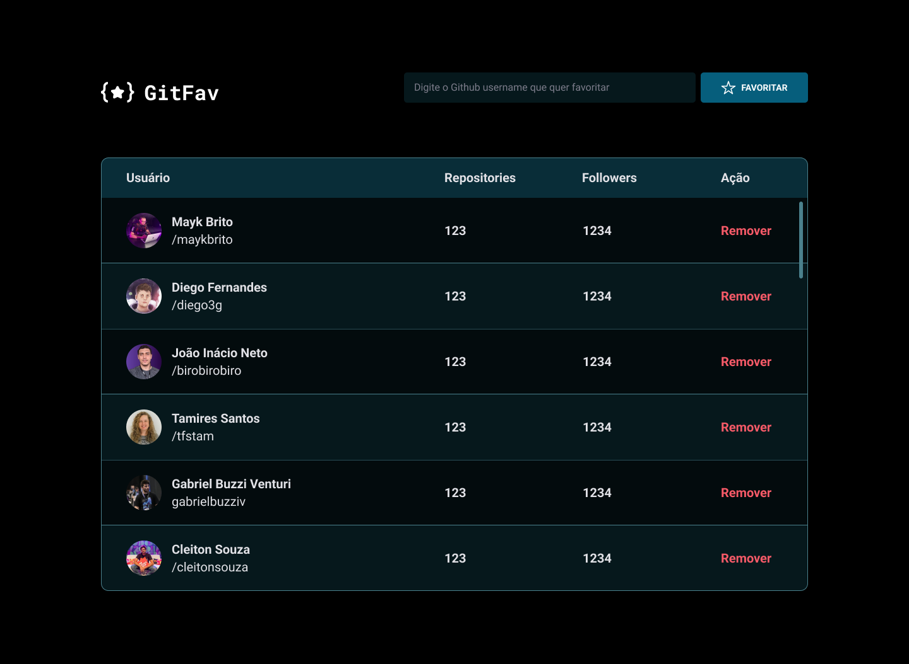

<h1 align="center"> Git Fav 👨‍💻</h1>

Git Fav

  <a href="#-tecnologias">Tecnologias</a>&nbsp;&nbsp;&nbsp;|&nbsp;&nbsp;&nbsp;
  <a href="#-projeto">Projeto</a>&nbsp;&nbsp;&nbsp;
  

 

  

## 🚀 Tecnologias

Esse projeto foi desenvolvido com as seguintes tecnologias:

- HTML e CSS
- JavaScript
- Git e Github
- Figma

## 💻 Projeto

A página de título Github Favorites é uma apicação desenvolvida durante o Stage 6 do curso Explorer da RocketSeat.

- [Acesse o projeto finalizado, online](https://viniciuszmota.github.io/GitFav2.0)

---

Feito com ♥ by Vinicius Zamprogno Mota, estudante na Rocketseat 👋
# GitFav2.0
